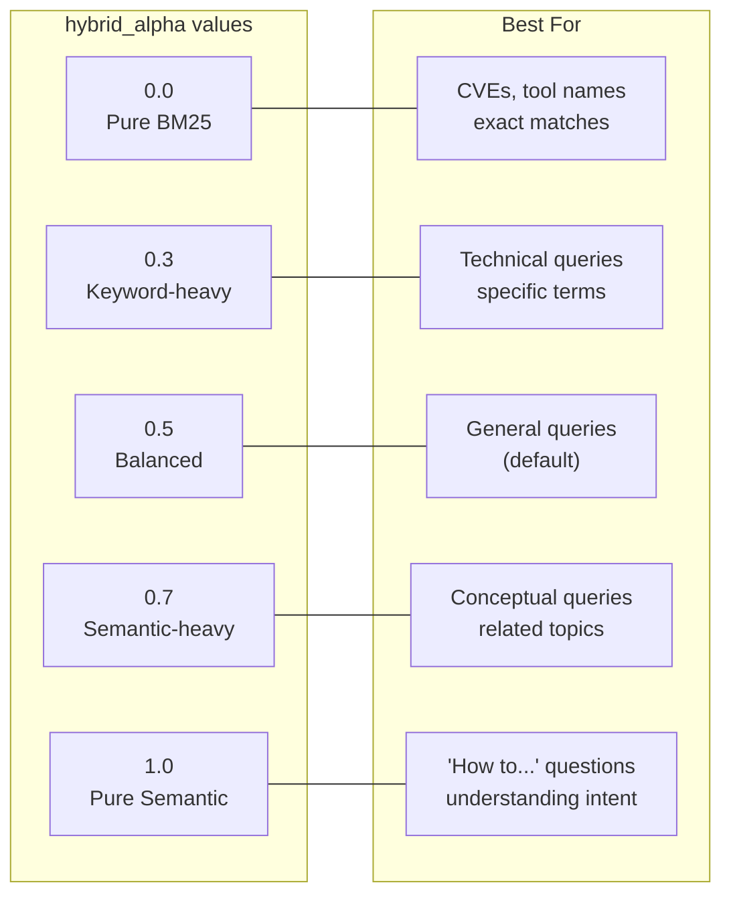

# Knowledge RAG System

<div align="center">


**Local RAG (Retrieval-Augmented Generation) System for Claude Code**

*Hybrid search (Semantic + BM25) with keyword routing for your personal knowledge base*

[Features](#features) | [Installation](#installation) | [Usage](#usage) | [API Reference](#api-reference) | [Architecture](#architecture)

</div>

---

## What's New in v2.0.0

### Hybrid Search
Combines **semantic search** (embeddings) with **BM25 keyword search** using Reciprocal Rank Fusion (RRF) for best-of-both-worlds retrieval:

- **Semantic search**: Finds conceptually similar content
- **BM25 keyword search**: Finds exact term matches (CVEs, tool names, etc.)
- **RRF fusion**: Combines both rankings for optimal results

### Improved Keyword Routing
- **Word boundaries**: No more false positives ("RAPID" no longer matches "api")
- **Weighted scoring**: Multiple keyword matches = higher confidence routing

### Performance Improvements
- **Parallel embeddings**: 4x faster indexing with ThreadPoolExecutor
- **Lazy BM25 initialization**: No startup delay

---

## Overview

Knowledge RAG is a **100% local** semantic search system that integrates with Claude Code via MCP (Model Context Protocol). It enables Claude to search through your documents (PDFs, Markdown, code, etc.) and retrieve relevant context for answering questions.

### Why Knowledge RAG?

- **Privacy First**: All processing happens locally - no data leaves your machine
- **Hybrid Search**: Combines semantic understanding with exact keyword matching
- **Multi-Format**: Supports MD, PDF, TXT, Python, JSON files
- **Smart Routing**: Keyword-based routing with word boundaries ensures accurate category matching
- **Claude Integration**: Native MCP tools for seamless Claude Code integration
- **Fast**: Parallel embedding generation + vector search with ChromaDB

---

## Features

| Feature | Description |
|---------|-------------|
| **Hybrid Search** | Semantic + BM25 keyword search with RRF fusion |
| **Keyword Routing** | Word-boundary aware routing for domain-specific queries |
| **Multi-Format Parser** | PDF, Markdown, TXT, Python, JSON support |
| **Chunking with Overlap** | Smart text splitting with context preservation |
| **Category Organization** | Organize docs by security, development, logscale, etc. |
| **MCP Integration** | Native Claude Code tools |
| **Persistent Storage** | ChromaDB with DuckDB backend |
| **Local Embeddings** | Ollama + nomic-embed-text (768 dimensions) |
| **Parallel Processing** | Multi-threaded embedding generation |

---

## Architecture

### System Overview

```mermaid
flowchart TB
    subgraph MCP["🔌 MCP SERVER (FastMCP)"]
        direction TB
        TOOLS["MCP Tools<br/>search_knowledge | get_document<br/>reindex_documents | list_categories"]
    end

    subgraph SEARCH["🔍 HYBRID SEARCH ENGINE"]
        direction LR
        ROUTER["Keyword Router<br/>(word boundaries)"]
        SEMANTIC["Semantic Search<br/>(ChromaDB)"]
        BM25["BM25 Keyword<br/>(rank-bm25)"]
        RRF["Reciprocal Rank<br/>Fusion (RRF)"]

        ROUTER --> SEMANTIC
        ROUTER --> BM25
        SEMANTIC --> RRF
        BM25 --> RRF
    end

    subgraph STORAGE["💾 STORAGE LAYER"]
        direction LR
        CHROMA[("ChromaDB<br/>Vector Database")]
        COLLECTIONS["Collections<br/>security | ctf<br/>logscale | development"]
        CHROMA --- COLLECTIONS
    end

    subgraph EMBED["🧠 EMBEDDINGS"]
        OLLAMA["Ollama<br/>nomic-embed-text<br/>(768 dimensions)"]
        PARALLEL["Parallel Processing<br/>(4 workers)"]
        OLLAMA --- PARALLEL
    end

    subgraph INGEST["📄 DOCUMENT INGESTION"]
        PARSERS["Parsers<br/>MD | PDF | TXT | PY | JSON"]
        CHUNKER["Chunking<br/>1000 chars + 200 overlap"]
        PARSERS --> CHUNKER
    end

    CLAUDE["☁️ Claude Code"] --> MCP
    MCP --> SEARCH
    SEARCH --> STORAGE
    STORAGE --> EMBED
    INGEST --> EMBED
    EMBED --> STORAGE
```



### Data Flow

#### 1. Document Ingestion Flow

```mermaid
flowchart LR
    subgraph INPUT["📁 Input"]
        FILES["documents/<br/>├── security/<br/>├── logscale/<br/>├── ctf/<br/>└── development/"]
    end

    subgraph PARSE["📖 Parse"]
        MD["Markdown<br/>Parser"]
        PDF["PDF Parser<br/>(PyMuPDF)"]
        TXT["Text<br/>Parser"]
        CODE["Code Parser<br/>(PY/JSON)"]
    end

    subgraph CHUNK["✂️ Chunk"]
        SPLIT["Text Splitter<br/>1000 chars"]
        OVERLAP["Overlap<br/>200 chars"]
        SPLIT --> OVERLAP
    end

    subgraph EMBED["🧠 Embed"]
        PARALLEL["ThreadPoolExecutor<br/>(4 workers)"]
        OLLAMA["Ollama API<br/>nomic-embed-text"]
        PARALLEL --> OLLAMA
    end

    subgraph STORE["💾 Store"]
        CHROMADB[("ChromaDB")]
        BM25IDX["BM25 Index"]
    end

    FILES --> MD & PDF & TXT & CODE
    MD & PDF & TXT & CODE --> CHUNK
    CHUNK --> EMBED
    EMBED --> STORE
```



#### 2. Query Processing Flow (Hybrid Search)

```mermaid
flowchart TB
    QUERY["🔍 User Query<br/>'mimikatz credential dump'"] --> ROUTER

    subgraph ROUTING["📍 Keyword Routing"]
        ROUTER["Keyword Router"]
        MATCH{"Word Boundary<br/>Match?"}
        CATEGORY["Filter: redteam"]
        NOFILTER["No Filter"]

        ROUTER --> MATCH
        MATCH -->|Yes| CATEGORY
        MATCH -->|No| NOFILTER
    end

    subgraph HYBRID["⚡ Hybrid Search"]
        direction LR
        SEMANTIC["Semantic Search<br/>(ChromaDB)<br/>Conceptual similarity"]
        BM25["BM25 Search<br/>(rank-bm25)<br/>Exact term matching"]
    end

    subgraph FUSION["🔀 Result Fusion"]
        RRF["Reciprocal Rank Fusion<br/>score = Σ 1/(k + rank)"]
        COMBINE["Combine Rankings<br/>+ Deduplicate"]
        SORT["Sort by<br/>Combined Score"]

        RRF --> COMBINE --> SORT
    end

    CATEGORY --> HYBRID
    NOFILTER --> HYBRID
    SEMANTIC --> RRF
    BM25 --> RRF

    SORT --> RESULTS["📋 Results<br/>search_method: hybrid|semantic|keyword<br/>semantic_rank + bm25_rank"]
```



#### 3. hybrid_alpha Parameter Effect



---

## Installation

### Prerequisites

- Windows 10/11
- Python 3.11 or 3.12
- [Ollama](https://ollama.com) (for local embeddings)
- Claude Code CLI

### Quick Install (Automated)

```powershell
# Clone the repository
git clone https://github.com/lyonzin/knowledge-rag.git
cd knowledge-rag

# Run the installer
.\install.ps1
```

### Manual Installation

1. **Install Python 3.12**
   ```powershell
   # Download from https://www.python.org/downloads/
   # Or use winget:
   winget install Python.Python.3.12
   ```

2. **Install Ollama**
   ```powershell
   # Download from https://ollama.com
   # Or use winget:
   winget install Ollama.Ollama
   ```

3. **Pull the embedding model**
   ```powershell
   ollama pull nomic-embed-text
   ```

4. **Clone and setup the project**
   ```powershell
   git clone https://github.com/lyonzin/knowledge-rag.git
   cd knowledge-rag

   # Create virtual environment
   python -m venv venv
   .\venv\Scripts\activate

   # Install dependencies
   pip install -r requirements.txt
   ```

5. **Configure MCP for Claude Code**

   Add to `~/.claude.json` under `mcpServers`:
   ```json
   {
     "mcpServers": {
       "knowledge-rag": {
         "type": "stdio",
         "command": "cmd",
         "args": ["/c", "cd /d C:\\path\\to\\knowledge-rag && .\\venv\\Scripts\\python.exe -m mcp_server.server"],
         "env": {}
       }
     }
   }
   ```

   > **Note**: We use `cmd /c` with `cd /d` to ensure the working directory is set correctly before starting the Python server. This is required because Claude Code may not respect the `cwd` property in MCP configurations.

6. **Restart Claude Code**

---

## Usage

### Adding Documents

Place your documents in the `documents/` directory, organized by category:

```
documents/
├── security/          # Pentest, exploit, vulnerability docs
│   ├── redteam/       # Red team specific
│   ├── blueteam/      # Blue team specific
│   └── RTFM.pdf
├── logscale/          # LogScale/LQL documentation
│   └── LQL_REFERENCE.md
├── ctf/               # CTF writeups and methodology
├── development/       # Code, APIs, frameworks
│   └── api-docs.md
└── general/           # Everything else
    └── notes.txt
```

### Indexing Documents

Documents are automatically indexed when Claude Code starts. To manually reindex:

```
# In Claude Code chat:
Use the reindex_documents tool with force=true to rebuild the index
```

### Searching

Simply ask Claude questions! The RAG system automatically provides context:

```
User: How do I use formatTime in LogScale?
Claude: [Uses search_knowledge internally, retrieves relevant chunks]
        Based on your documentation, formatTime in LogScale...
```

### Hybrid Search Control

You can control the balance between semantic and keyword search:

```javascript
// Balanced hybrid (default) - best for general queries
search_knowledge("SQL injection techniques", hybrid_alpha=0.5)

// More semantic - better for conceptual queries
search_knowledge("techniques for escalating privileges", hybrid_alpha=0.8)

// More keyword - better for exact terms
search_knowledge("CVE-2021-44228", hybrid_alpha=0.2)

// Pure keyword search
search_knowledge("mimikatz sekurlsa", hybrid_alpha=0.0)

// Pure semantic search
search_knowledge("how to bypass authentication", hybrid_alpha=1.0)
```

---

## API Reference

### MCP Tools

#### `search_knowledge`

Hybrid search combining semantic search + BM25 keyword search.

**Parameters:**
| Name | Type | Default | Description |
|------|------|---------|-------------|
| `query` | string | required | Search query text |
| `max_results` | int | 5 | Maximum results (1-20) |
| `category` | string | null | Filter by category |
| `hybrid_alpha` | float | 0.5 | Balance: 0.0=keyword only, 1.0=semantic only |

**Returns:** JSON with search results including content, source, relevance score, and search method.

**Example:**
```json
{
  "status": "success",
  "query": "mimikatz credential dump",
  "hybrid_alpha": 0.5,
  "result_count": 3,
  "results": [
    {
      "content": "Mimikatz can extract credentials from memory...",
      "source": "C:/docs/security/redteam/credential-attacks.pdf",
      "filename": "credential-attacks.pdf",
      "category": "redteam",
      "score": 0.016393,
      "semantic_rank": 2,
      "bm25_rank": 1,
      "search_method": "hybrid",
      "keywords": ["mimikatz", "credential", "lsass"],
      "routed_by": "redteam"
    }
  ]
}
```

**Search Method Values:**
- `hybrid`: Found by both semantic and BM25 search (highest confidence)
- `semantic`: Found only by semantic search
- `keyword`: Found only by BM25 keyword search

#### `get_document`

Retrieve the full content of a specific document.

**Parameters:**
| Name | Type | Description |
|------|------|-------------|
| `filepath` | string | Path to the document |

**Returns:** JSON with document content and metadata.

#### `reindex_documents`

Index or reindex all documents in the knowledge base.

**Parameters:**
| Name | Type | Default | Description |
|------|------|---------|-------------|
| `force` | bool | false | If true, clears and rebuilds entire index (both ChromaDB and BM25) |

**Returns:** JSON with indexing statistics.

#### `list_categories`

List all document categories with their document counts.

**Returns:**
```json
{
  "status": "success",
  "categories": {
    "security": 52,
    "Detections_Rules ": 12,
    "redteam": 3,
    "blueteam": 3,
    "ctf": 2,
    "general": 1
  },
  "total_documents": 73
}
```

#### `list_documents`

List all indexed documents, optionally filtered by category.

**Parameters:**
| Name | Type | Description |
|------|------|-------------|
| `category` | string | Optional category filter |

#### `get_index_stats`

Get statistics about the knowledge base index.

**Returns:**
```json
{
  "status": "success",
  "stats": {
    "total_documents": 73,
    "total_chunks": 9256,
    "categories": {"security": 52, "logscale": 12, ...},
    "embedding_model": "nomic-embed-text",
    "chunk_size": 1000,
    "chunk_overlap": 200
  }
}
```

---

## Configuration

### Keyword Routing

The system uses keyword routing with word boundaries to improve search accuracy.

```mermaid
flowchart TB
    QUERY["Query: 'CVE-2021-44228 log4j'"] --> EXTRACT["Extract Keywords"]

    subgraph ROUTES["🏷️ Keyword Routes (config.py)"]
        SEC["security<br/>anti-bot, waf bypass, cloudflare..."]
        RED["redteam<br/>pentest, exploit, payload..."]
        BLUE["blueteam<br/>detection, sigma, yara..."]
        CTF["ctf<br/>ctf, flag, hackthebox..."]
        LOG["logscale<br/>logscale, humio, lql..."]
        DEV["development<br/>python, javascript, api..."]
    end

    EXTRACT --> CHECK{"Word Boundary<br/>Check (\\b)"}

    CHECK -->|"'api' in query?"| BOUNDARY["Does NOT match<br/>'RAPID' or 'capital'"]
    CHECK -->|"'log4j' matches"| MATCHED["✓ Matches 'security'<br/>route"]

    BOUNDARY --> NOROUTE["No routing applied"]
    MATCHED --> WEIGHT["Weighted Scoring<br/>Multiple matches = higher confidence"]
    WEIGHT --> FILTER["Filter to 'security' category"]
```



Configure routes in `mcp_server/config.py`:

```python
keyword_routes = {
    "security": ["anti-bot", "waf bypass", "cloudflare", ...],
    "redteam": ["pentest", "exploit", "payload", "reverse shell", ...],
    "blueteam": ["detection", "sigma", "yara", "incident response", ...],
    "ctf": ["ctf", "flag", "hackthebox", "tryhackme", ...],
    "Detections_Rules": ["logscale", "humio", "lql", "formatTime", ...],
    "development": ["python", "javascript", "api", "docker", ...]
}
```

**Word Boundary Matching**: Single-word keywords use regex word boundaries (`\b`) to prevent false positives. For example, "api" won't match "RAPID".

**Weighted Scoring**: When multiple keywords match, the category with the most matches wins.

### Chunking Settings

Adjust chunk size and overlap in `config.py`:

```python
chunk_size = 1000      # Characters per chunk
chunk_overlap = 200    # Overlap between chunks
```

### Embedding Model

The default model is `nomic-embed-text`. To change:

1. Pull a different model: `ollama pull <model-name>`
2. Update `config.py`: `ollama_model = "<model-name>"`

### Hybrid Search Tuning

The `hybrid_alpha` parameter controls the balance:

| hybrid_alpha | Behavior | Best For |
|--------------|----------|----------|
| 0.0 | Pure BM25 keyword | Exact terms, CVEs, tool names |
| 0.3 | Keyword-heavy | Technical queries with specific terms |
| 0.5 | Balanced (default) | General queries |
| 0.7 | Semantic-heavy | Conceptual queries |
| 1.0 | Pure semantic | "How to..." questions |

---

## Project Structure

```mermaid
flowchart TB
    subgraph ROOT["📁 knowledge-rag/"]
        direction TB

        subgraph SERVER["🐍 mcp_server/"]
            INIT["__init__.py"]
            CONFIG["config.py<br/>(settings, routes)"]
            INGEST["ingestion.py<br/>(parsing, chunking)"]
            SERV["server.py<br/>(MCP, ChromaDB, BM25)"]
        end

        subgraph DOCS["📚 documents/"]
            SEC["security/<br/>Pentest, exploits"]
            LOG["logscale/<br/>LQL docs"]
            DEV["development/<br/>Code, APIs"]
            GEN["general/<br/>Everything else"]
        end

        subgraph DATA["💾 data/"]
            CHROMA["chroma_db/<br/>(Vector storage)"]
            META["index_metadata.json"]
        end

        subgraph FILES["📄 Root Files"]
            INSTALL["install.ps1"]
            REQS["requirements.txt"]
            README["README.md"]
            CHANGE["CHANGELOG.md"]
        end
    end
```



```
knowledge-rag/
├── mcp_server/
│   ├── __init__.py
│   ├── config.py          # Configuration settings
│   ├── ingestion.py       # Document parsing & chunking
│   └── server.py          # MCP server, ChromaDB, BM25
├── documents/             # Your documents go here
│   ├── security/
│   ├── Detections_Rules/
│   ├── development/
│   └── general/
├── data/
│   ├── chroma_db/         # Vector database storage
│   └── index_metadata.json
├── .claude/
│   └── mcp.json           # Project MCP config
├── venv/                  # Python virtual environment
├── install.ps1            # Automated installer
├── requirements.txt       # Python dependencies
├── CHANGELOG.md           # Version history
└── README.md              # This file
```

---

## Troubleshooting

### Ollama not running

```powershell
# Start Ollama
ollama serve

# Or check if running
curl http://localhost:11434/api/tags
```

### Python version mismatch

ChromaDB requires Python 3.11 or 3.12. Python 3.13+ is NOT supported due to onnxruntime compatibility.

```powershell
# Check version
python --version

# Use specific version
py -3.12 -m venv venv
```

### Index is empty

```powershell
# Check documents directory
ls documents/

# Force reindex
# In Claude Code: use reindex_documents(force=true)
```

### MCP server not loading

1. Check `~/.claude.json` exists and has `mcpServers` section with valid JSON
2. Verify paths use double backslashes (`\\`) on Windows
3. Restart Claude Code completely
4. Run `claude mcp list` to check connection status

### "ModuleNotFoundError: No module named 'rank_bm25'"

Install the BM25 dependency in your virtual environment:

```powershell
.\venv\Scripts\pip.exe install rank-bm25
```

### "ModuleNotFoundError: No module named 'mcp_server'"

This error occurs when Claude Code doesn't set the working directory correctly. **Solution**: Use the `cmd /c "cd /d ... && python"` wrapper in your config:

```json
{
  "knowledge-rag": {
    "type": "stdio",
    "command": "cmd",
    "args": ["/c", "cd /d C:\\path\\to\\knowledge-rag && .\\venv\\Scripts\\python.exe -m mcp_server.server"],
    "env": {}
  }
}
```

---

## Changelog

### v2.1.0 (2026-02-05)
- **NEW**: Interactive Mermaid flowcharts for architecture visualization
- **NEW**: Query processing flow diagram showing hybrid search internals
- **NEW**: Document ingestion pipeline diagram
- **NEW**: Keyword routing visual explanation
- **NEW**: hybrid_alpha parameter effect diagram
- **NEW**: Project structure visual diagram
- **IMPROVED**: Documentation now GitHub-native with dark/light theme support

### v2.0.0 (2025-01-20)
- **NEW**: Hybrid search combining semantic + BM25 keyword search
- **NEW**: Reciprocal Rank Fusion (RRF) for optimal result ranking
- **NEW**: `hybrid_alpha` parameter to control search balance
- **NEW**: `search_method` field in results (hybrid/semantic/keyword)
- **IMPROVED**: Keyword routing with word boundaries (no more false positives)
- **IMPROVED**: Weighted scoring for multiple keyword matches
- **IMPROVED**: Parallel embedding generation (4x faster indexing)
- **IMPROVED**: Input validation on MCP tools
- **FIXED**: Chunk loop infinite loop potential
- **FIXED**: Embedding error handling

### v1.0.1 (2025-01-16)
- Auto-cleanup orphan UUID folders on reindex
- Removed hardcoded user paths
- Made install.ps1 plug-and-play

### v1.0.0 (2025-01-15)
- Initial release

---

## Contributing

1. Fork the repository
2. Create a feature branch (`git checkout -b feature/amazing-feature`)
3. Commit your changes (`git commit -m 'Add amazing feature'`)
4. Push to the branch (`git push origin feature/amazing-feature`)
5. Open a Pull Request

---

## License

This project is licensed under the MIT License - see the [LICENSE](LICENSE) file for details.

---

## Acknowledgments

- [ChromaDB](https://www.trychroma.com/) - Vector database
- [Ollama](https://ollama.com/) - Local LLM & embeddings
- [FastMCP](https://github.com/anthropics/mcp) - MCP framework
- [PyMuPDF](https://pymupdf.readthedocs.io/) - PDF parsing
- [rank-bm25](https://github.com/dorianbrown/rank_bm25) - BM25 implementation

---

## Author

**Ailton Rocha (Lyon)**

AI Operator | Security Researcher | Developer

---

<div align="center">

**[Back to Top](#knowledge-rag-system)**

</div>
